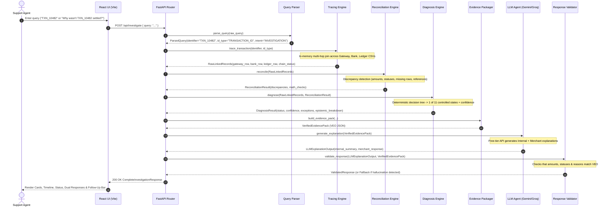
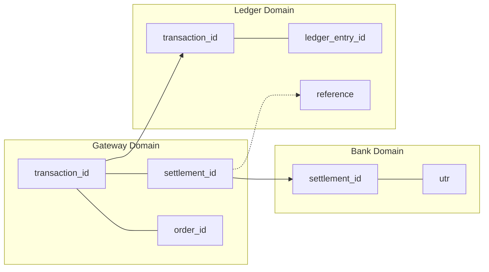
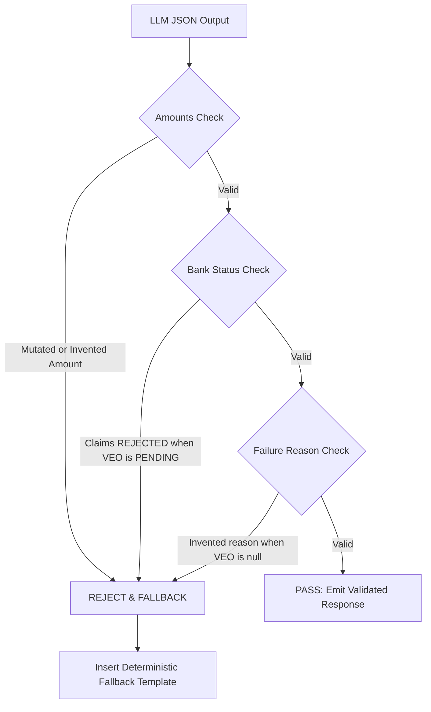
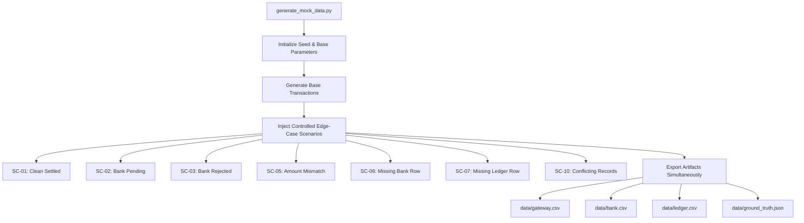

# Technical Architecture Document (arch.md)

## Project: PS-8 — Settlement Q&A Agent for Fintech Support
**Document Version:** 1.0.0  
**Status:** Approved for Implementation  
**Architecture Style:** Modular Monolith (Python/FastAPI + React/Vite)  
**Foundational Rule:** *Deterministic code establishes financial truth. AI explains verified evidence.*

---

## 1. System Overview & Core Architectural Principle

The **Settlement Q&A Agent** is a specialized fintech support investigation system designed to eliminate manual cross-system correlation for payment disputes. It unifies three synthetic payment silos—**Gateway Logs**, **Bank Clearing Records**, and **Internal Accounting Ledgers**—into a single deterministic investigation engine, augmented by a tightly constrained Large Language Model (LLM) explanation layer.

### 1.1 The Strict Separation of Concerns
The fundamental architectural invariant is:

$$\text{Financial Truth} = f_{\text{code}}(\text{Gateway}, \text{Bank}, \text{Ledger})$$
$$\text{Explanation} = g_{\text{LLM}}(\text{Financial Truth})$$

The system strictly rejects the pattern `Raw Data → LLM → Decision`. The LLM is never permitted to perform joins, calculate fee net amounts, evaluate missing records, or classify settlement states.

```
┌────────────────────────────────────────────────────────────────────────────────────────┐
│                                DETERMINISTIC BOUNDARY                                  │
│                                                                                        │
│  [Gateway CSV] ─┐                                                                      │
│  [Bank CSV]    ──┼─► [Reference Chaining] ─► [Reconciliation] ─► [Diagnosis & Exception]│
│  [Ledger CSV]  ─┘                                                        │             │
│                                                                          ▼             │
│                                                            [Verified Evidence Pack]    │
└───────────────────────────────────────────┬──────────────────────────────┼─────────────┘
                                            │                              │
                                            ▼                              ▼
                                 [Deterministic UI View]        ┌────────────────────────┐
                                 • Status Badges                │  AI EXPLANATION LAYER  │
                                 • 3-System Inspector Cards     │  • Free-tier LLM       │
                                 • Chronological Timeline       │  • Structured Output   │
                                 • Discrepancy Banners          │  • Deterministic Guard │
                                                                └──────────┬─────────────┘
                                                                           ▼
                                                                [Dual Support Response]
                                                                • Internal Tech Summary
                                                                • Merchant-Safe Script
```

### 1.2 Architectural Guardrail Guarantees
1. **Zero Hallucinated Amounts:** Currency figures and math are derived solely in Python using `Decimal`. The LLM is passed pre-computed net amounts.
2. **Zero Hallucinated Bank Reasons:** If `bank.csv` has a null `failure_reason`, the system tags the reason as missing; the LLM is barred by prompt and validation from supplying external hypotheses.
3. **Deterministic State Machine:** Classification into the 11 controlled settlement states is executed via unambiguous Python decision trees with 100% test reproducibility.
4. **Resilient Degradation:** If the LLM provider times out or fails, 100% of the deterministic investigation (statuses, discrepancies, timelines, amounts) is still rendered in the UI.

---

## 2. Architectural Style: Why a Modular Monolith?

For this hackathon project, the system is designed as a **Modular Monolith** comprising a Python FastAPI backend and a React (Vite) single-page application.

### 2.1 Monolith Justification Matrix

| Architectural Consideration | Distributed Microservices / Agent Swarms | Modular Monolith (Chosen) |
| :--- | :--- | :--- |
| **Data Consistency** | Eventual consistency; network latency joining 3 datasets; complex distributed tracing. | In-memory atomic joins; zero network latency across CSVs; instant deterministic reconciliation ($<15\text{ ms}$). |
| **Operational Overhead** | Docker compose with multiple containers, message brokers (Kafka/RabbitMQ), service discovery. | Single backend process (`uvicorn main:app`) + single frontend dev server (`npm run dev`). One `.env` file. |
| **Debugging & Testability** | Distributed logs, asynchronous race conditions, difficult local integration testing. | Unified Pytest suite testing pipeline end-to-end in milliseconds without mocks. |
| **Hackathon Velocity** | 40% time spent on boilerplate RPC/HTTP contracts and inter-service networking. | 100% time spent on fintech reconciliation logic, epistemic honesty, and clean UI. |

The codebase enforces strict logical boundaries between modules. Domain entities do not depend on API layers, and the reconciliation engine has zero knowledge of the presentation or LLM layers.

---

## 3. End-to-End Application Flow

The system processes an investigation request through an eleven-stage unidirectional pipeline:



### 3.1 Stage-by-Stage Specification

| Stage | Input | Output | Responsibility | Type | Failure Possibilities & Handling |
| :--- | :--- | :--- | :--- | :--- | :--- |
| **1. User Query** | Raw text string | HTTP Request | Capture user input in search bar | UI | Network failure; render offline banner |
| **2. Query Parser** | Text string | `ParsedQuery` | Extract target ID, detect query type (ID, date, or NL) | Deterministic | Unrecognized query format $\rightarrow$ return 400 Bad Request with format guide |
| **3. Tracing Engine** | Entity ID & Type | `RawLinkedRecords` | Traverses graph hops across Gateway, Bank, Ledger | Deterministic | Target not found $\rightarrow$ return `NOT_FOUND` envelope; Broken chain $\rightarrow$ emit flag |
| **4. Normalization** | CSV Row dicts | `NormalizedEvidence` | Cast types (`Decimal`, ISO dates), clean null strings | Deterministic | Corrupted float $\rightarrow$ fallback to 0.0 with parsing error flag |
| **5. Reconciliation** | `NormalizedEvidence` | `ReconciliationResult` | Evaluates 9 discrepancy rules (amounts, statuses) | Deterministic | None (pure algorithmic comparison) |
| **6. Diagnosis** | Normed Data + Breaks | `DiagnosisResult` | Evaluates 11-state priority tree, assigns confidence | Deterministic | None (state machine handles every edge case) |
| **7. Exception Engine** | Breakes + Unresolved | `List[ExceptionItem]` | Classifies epistemic gaps (Known vs Inferred vs Unknown) | Deterministic | None (deterministic bucket assignment) |
| **8. Evidence Packager**| Diagnosis + Data | `VerifiedEvidencePack` | Compiles immutable VEO JSON contract | Deterministic | None |
| **9. LLM Synthesis** | `VerifiedEvidencePack` | Raw LLM JSON | Translates VEO into dual human explanations | AI-Driven | API timeout / quota exhaustion $\rightarrow$ caught by router; return deterministic fallback |
| **10. Response Validator**| LLM Output + VEO | `ValidatedResponse` | Verifies LLM text didn't mutate amounts or invent reasons | Deterministic | Hallucination detected $\rightarrow$ drop LLM text, substitute deterministic template |
| **11. Presentation** | Complete Response | Visual DOM | Renders cards, badges, timeline, and copy buttons | UI | JavaScript render error $\rightarrow$ React ErrorBoundary |

---

## 4. Specialized Investigation Workflows

### 4.1 Flow A: Direct Transaction ID Lookup
1. Input: `TXN_10482`.
2. Tracing Engine indexes `gateway.csv` by `transaction_id`. Row found.
3. Extract `gateway.settlement_id = SET_55012`.
4. Tracing Engine indexes `bank.csv` by `settlement_id`. Row found (`bank_status = PENDING`, `utr = null`).
5. Tracing Engine indexes `ledger.csv` by `transaction_id`. Row found (`ledger_status = POSTED`, `credit = 4850.00`).
6. Pipeline evaluates math: $\text{Gateway Amount } (5000.00) - \text{Fee } (150.00) = 4850.00$. Ledger credit is $4850.00$. Match verified.
7. Bank status is `PENDING`. Engine assigns diagnosis `SETTLEMENT_PENDING`, Confidence `MEDIUM`.
8. Output packaged and sent to LLM.

### 4.2 Flow B: Natural Language Investigation
1. Input: *"Why wasn't TXN_10482 settled?"*
2. Query parser executes regex pattern matching: `\b(TXN_\d+|ORD_\d+|SET_\d+|UTR[A-Z0-9]+)\b`.
3. Matches `TXN_10482`.
4. Parser sets `intent = "WHY_NOT_SETTLED"`.
5. Resolves data via Flow A.
6. The user's exact natural question is passed alongside the VEO to the LLM agent prompt to ensure the explanation specifically addresses *"Why wasn't this settled?"*.

### 4.3 Flow C: Date-Based Investigation
1. Input: *"Show delayed settlements from September 3"* or `date = "2026-09-03"`.
2. Parser extracts ISO date `2026-09-03` and filter criteria (`delayed` $\rightarrow$ status `SETTLEMENT_PENDING`).
3. Tracing Engine performs vector/batch scan on `gateway.csv` where `created_at` or `captured_at` falls within `2026-09-03T00:00:00Z` to `2026-09-03T23:59:59Z`.
4. For each matched transaction (e.g., 500 rows), the pipeline runs Steps 3–7 in memory.
5. Aggregates results:
   * Total Investigated: 500
   * Successfully Settled: 442
   * Pending: 31
   * Amount Mismatches: 12
   * Bank Rejected: 7
   * Missing Records: 8
6. Returns aggregated summary plus list of exception transaction rows to populate the Exception Dashboard. **(No LLM call required for date aggregation, ensuring $<500\text{ ms}$ response).**

### 4.4 Flow D: Context-Preserving Follow-Up Q&A
1. Input: Support agent asks: *"Did our ledger record the payment?"* while viewing `TXN_10482`.
2. Frontend sends `POST /api/follow-up` containing `{ transaction_id: "TXN_10482", question: "Did our ledger record the payment?" }`.
3. Backend fetches the cached VEO for `TXN_10482`.
4. System invokes LLM with a dedicated single-turn follow-up prompt containing the cached VEO and the agent's question.
5. Guardrail: The LLM is explicitly instructed: *"Answer the question using ONLY the provided evidence. If the information is not in the evidence, state 'That information is not recorded in our system logs.'"*
6. LLM returns: *"Yes. Internal ledger entry LED_701928 recorded a credit of ₹4,850.00 on 2026-09-03 at 10:32:18 UTC with status POSTED."*

---

## 5. Normalized Data Architecture & In-Memory Store

Raw CSV rows contain inconsistent column names, unparsed string timestamps, and missing fields. The data layer normalizes all inputs into strongly typed Pydantic models at startup.

```
data/
├── gateway.csv        # Primary capture logs
├── bank.csv           # Partner clearing logs
├── ledger.csv         # Internal double-entry accounting records
└── ground_truth.json  # Authoritative evaluation oracle
```

### 5.1 Internal Normalized Domain Entities

```python
class GatewayRecord(BaseModel):
    transaction_id: str
    order_id: str
    gateway_reference: str
    gross_amount: Decimal
    fee_amount: Decimal
    net_expected_amount: Decimal
    status: Literal["AUTHORIZED", "CAPTURED", "FAILED", "REFUNDED"]
    created_at: datetime
    captured_at: Optional[datetime] = None
    settlement_id: Optional[str] = None

class BankRecord(BaseModel):
    settlement_id: str
    utr: Optional[str] = None
    disbursed_amount: Optional[Decimal] = None
    settlement_date: Optional[date] = None
    bank_status: Literal["SETTLED", "PENDING", "REJECTED"]
    failure_reason: Optional[str] = None

class LedgerRecord(BaseModel):
    ledger_entry_id: str
    transaction_id: str
    entry_type: Literal["CREDIT", "DEBIT"]
    debit: Decimal
    credit: Decimal
    entry_date: datetime
    ledger_status: Literal["POSTED", "PENDING", "REVERSED", "HOLD"]
    reference: Optional[str] = None
```

### 5.2 In-Memory Data Store & Indexing
To avoid file I/O latency on every query, `server/ingestion/data_store.py` loads and indexes the CSV files at application boot into memory:
* `gateway_by_txn_id: Dict[str, GatewayRecord]`
* `gateway_by_order_id: Dict[str, GatewayRecord]`
* `gateway_by_settlement_id: Dict[str, List[GatewayRecord]]`
* `bank_by_settlement_id: Dict[str, BankRecord]`
* `bank_by_utr: Dict[str, BankRecord]`
* `ledger_by_txn_id: Dict[str, List[LedgerRecord]]`
* `ledger_by_reference: Dict[str, List[LedgerRecord]]`

All lookup operations execute in $\mathcal{O}(1)$ time.

---

## 6. Multi-Hop Reference-Chain Architecture

Real-world fintech systems rarely have a single ID common to all records. The tracing engine performs bidirectional graph traversal to unify records.



### 6.1 Resolution Algorithm
```python
def resolve_chain(query_id: str) -> ResolvedChain:
    # 1. Attempt Gateway direct match
    gw = store.get_gateway(query_id) # by txn_id or order_id
    
    if gw:
        settlement_id = gw.settlement_id
        bank = store.get_bank_by_settlement_id(settlement_id) if settlement_id else None
        ledger = store.get_ledger_by_txn_id(gw.transaction_id)
        return ResolvedChain(gateway=gw, bank=bank, ledger=ledger)
        
    # 2. Attempt Bank direct match (via UTR or settlement_id)
    bank = store.get_bank_by_utr(query_id) or store.get_bank_by_settlement_id(query_id)
    if bank:
        gws = store.get_gateways_by_settlement_id(bank.settlement_id)
        gw = gws[0] if gws else None
        ledger = store.get_ledger_by_txn_id(gw.transaction_id) if gw else store.get_ledger_by_ref(bank.settlement_id)
        return ResolvedChain(gateway=gw, bank=bank, ledger=ledger)
        
    # 3. Attempt Ledger direct match
    ledger = store.get_ledger_by_entry_id(query_id)
    if ledger:
        gw = store.get_gateway(ledger.transaction_id)
        bank = store.get_bank_by_settlement_id(gw.settlement_id) if (gw and gw.settlement_id) else None
        return ResolvedChain(gateway=gw, bank=bank, ledger=ledger)
        
    return ResolvedChain(found=False)
```

---

## 7. Deterministic Reconciliation & Diagnosis Engines

### 7.1 Reconciliation Engine (`server/reconciliation/`)
The reconciliation engine executes 6 discrete audits on the resolved chain:

1. **Existence Check:** Verifies presence of records across Gateway, Bank, and Ledger.
2. **Amount Consistency:** Tests whether $\left|(\text{gross\_amount} - \text{fee}) - \text{disbursed\_amount}\right| < 0.01$ and $\left|\text{disbursed\_amount} - \text{credit}\right| < 0.01$.
3. **Status Alignment:** Detects contradictory states (e.g., Gateway `CAPTURED` + Bank `SETTLED` + Ledger `REVERSED`).
4. **Reference Integrity:** Checks if `ledger.reference == gateway.settlement_id`.
5. **Duplicate Detection:** Scans index for duplicate keys.
6. **Temporal Order Audit:** Verifies $\text{captured\_at} \le \text{ledger.entry\_date} \le \text{bank.settlement\_date}$.

#### Reconciliation Output Schema:
```json
{
  "is_reconciled": false,
  "discrepancies": [
    {
      "code": "ERR_AMOUNT_MISMATCH",
      "severity": "CRITICAL",
      "message": "Gateway expected net ₹4,850.00 but Bank disbursed ₹4,500.00 (Difference: ₹350.00)"
    }
  ],
  "math_verification": {
    "gross": 5000.00,
    "fee": 150.00,
    "net_expected": 4850.00,
    "bank_disbursed": 4500.00,
    "ledger_credited": 4850.00,
    "variance": -350.00
  }
}
```

### 7.2 Deterministic Diagnosis Engine (`server/diagnosis/`)
The diagnosis engine maps the reconciled evidence onto the controlled 11-state taxonomy. To avoid ambiguity, rules are evaluated in **strict priority order**:

```python
def determine_diagnosis(chain: ResolvedChain, recon: ReconciliationResult) -> SettlementDiagnosis:
    # Priority 1: Missing Gateway record
    if not chain.gateway:
        return SettlementDiagnosis.INSUFFICIENT_EVIDENCE
        
    # Priority 2: Gateway failed payment
    if chain.gateway.status == "FAILED":
        if chain.bank and chain.bank.bank_status == "SETTLED":
            return SettlementDiagnosis.CONFLICTING_EVIDENCE
        return SettlementDiagnosis.GATEWAY_FAILED
        
    # Priority 3: Duplicate records detected
    if recon.has_error("ERR_DUPLICATE_RECORD"):
        return SettlementDiagnosis.DUPLICATE_RECORD

    # Priority 4: Conflicting evidence / Status contradictions
    if recon.has_error("ERR_CONFLICTING_EVIDENCE") or (chain.ledger and chain.ledger.ledger_status == "REVERSED"):
        return SettlementDiagnosis.CONFLICTING_EVIDENCE

    # Priority 5: Bank explicit rejection
    if chain.bank and chain.bank.bank_status == "REJECTED":
        return SettlementDiagnosis.BANK_REJECTED

    # Priority 6: Unbatched captured payment
    if chain.gateway.status == "CAPTURED" and not chain.gateway.settlement_id:
        return SettlementDiagnosis.SETTLEMENT_PENDING

    # Priority 7: Missing Bank file record
    if chain.gateway.settlement_id and not chain.bank:
        return SettlementDiagnosis.MISSING_BANK_RECORD

    # Priority 8: Missing Ledger entry
    if not chain.ledger:
        return SettlementDiagnosis.MISSING_LEDGER_RECORD

    # Priority 9: Amount mismatch
    if recon.has_error("ERR_AMOUNT_MISMATCH"):
        return SettlementDiagnosis.AMOUNT_MISMATCH

    # Priority 10: Reference mismatch
    if recon.has_error("ERR_REFERENCE_MISMATCH"):
        return SettlementDiagnosis.REFERENCE_MISMATCH

    # Priority 11: In-flight bank settlement
    if chain.bank.bank_status == "PENDING":
        return SettlementDiagnosis.SETTLEMENT_PENDING

    # Priority 12: Successfully settled
    if (chain.gateway.status == "CAPTURED" and 
        chain.bank.bank_status == "SETTLED" and 
        chain.ledger.ledger_status == "POSTED" and 
        chain.bank.utr is not None):
        return SettlementDiagnosis.SUCCESSFULLY_SETTLED

    return SettlementDiagnosis.INSUFFICIENT_EVIDENCE
```

---

## 8. Epistemic Exception Engine & Confidence Architecture

### 8.1 Epistemic Honesty Model
The exception engine (`server/exceptions/`) separates findings into three operational classifications:

```
                  ┌─────────────────────────────────────┐
                  │          EVIDENCE INPUT             │
                  └──────────────────┬──────────────────┘
                                     │
           ┌─────────────────────────┼─────────────────────────┐
           ▼                         ▼                         ▼
     [KNOWN FACTS]            [INFERRED FACTS]          [UNKNOWN FACTS]
• Direct record values    • Multi-source math       • Omitted / missing data
• Verified status codes   • SLA elapsed durations   • Null UTRs / timestamps
• Recorded bank UTRs      • Expected net payouts    • Blank failure reasons
```

If a field is missing, the engine emits a discrete exception token:
* `BANK_RECORD_MISSING`
* `BANK_FAILURE_REASON_MISSING`
* `BANK_COMPLETION_TIMESTAMP_MISSING`
* `BANK_UTR_MISSING`
* `LEDGER_RECORD_MISSING`
* `SETTLEMENT_BATCH_UNASSIGNED`

### 8.2 Deterministic Confidence Calculation
Confidence is determined by an explicit rule matrix, never by LLM sentiment:

```python
def calculate_confidence(chain: ResolvedChain, diagnosis: SettlementDiagnosis, recon: ReconciliationResult) -> Tuple[ConfidenceLevel, str]:
    if diagnosis in [SettlementDiagnosis.SUCCESSFULLY_SETTLED, SettlementDiagnosis.GATEWAY_FAILED]:
        return ConfidenceLevel.HIGH, "All required system records are present and in full agreement."
        
    if diagnosis == SettlementDiagnosis.BANK_REJECTED and chain.bank.failure_reason:
        return ConfidenceLevel.HIGH, "Bank clearing explicitly returned a confirmed failure reason code."
        
    if diagnosis == SettlementDiagnosis.SETTLEMENT_PENDING:
        if chain.gateway and chain.ledger and chain.bank:
            return ConfidenceLevel.MEDIUM, "Capture and ledger verified; bank clearing is actively in progress."
        return ConfidenceLevel.MEDIUM, "Payment captured; awaiting settlement batch creation."
        
    if diagnosis in [
        SettlementDiagnosis.MISSING_BANK_RECORD,
        SettlementDiagnosis.MISSING_LEDGER_RECORD,
        SettlementDiagnosis.AMOUNT_MISMATCH,
        SettlementDiagnosis.CONFLICTING_EVIDENCE,
        SettlementDiagnosis.INSUFFICIENT_EVIDENCE
    ]:
        return ConfidenceLevel.LOW, "Critical evidence is absent, broken, or contradictory across records."
        
    return ConfidenceLevel.LOW, "Incomplete multi-system evidence chain."
```

---

## 9. Verified Evidence Pack & AI Explanation Layer

### 9.1 The Verified Evidence Pack (VEO Contract)
The Verified Evidence Pack is the single interface passed to the AI layer:

```json
{
  "investigation_id": "INV_20260904_10482",
  "query_identifier": "TXN_10482",
  "diagnosis": "SETTLEMENT_PENDING",
  "confidence": "MEDIUM",
  "confidence_reason": "Capture and ledger verified; bank clearing is actively in progress.",
  "gateway": {
    "present": true,
    "transaction_id": "TXN_10482",
    "order_id": "ORD_90210",
    "status": "CAPTURED",
    "gross_amount": 5000.00,
    "fee_amount": 150.00,
    "net_amount": 4850.00,
    "captured_at": "2026-09-03T10:32:17Z",
    "settlement_id": "SET_55012"
  },
  "bank": {
    "present": true,
    "settlement_id": "SET_55012",
    "bank_status": "PENDING",
    "utr": null,
    "disbursed_amount": null,
    "failure_reason": null,
    "settlement_date": null
  },
  "ledger": {
    "present": true,
    "ledger_entry_id": "LED_701928",
    "ledger_status": "POSTED",
    "credit_amount": 4850.00,
    "entry_date": "2026-09-03T10:32:18Z"
  },
  "discrepancies": [],
  "epistemic_model": {
    "known_facts": [
      "Customer charged ₹5,000.00; fee of ₹150.00 deducted; payment captured at 10:32:17 UTC",
      "Ledger posted credit of ₹4,850.00 to account batch SET_55012",
      "Bank settlement record exists with status PENDING"
    ],
    "inferred_facts": [
      "Expected net payout is ₹4,850.00"
    ],
    "unknown_facts": [
      "Bank completion timestamp is missing",
      "Bank UTR has not yet been generated",
      "Bank delay reason is unrecorded"
    ]
  },
  "timeline": [
    { "timestamp": "2026-09-03T10:32:14Z", "event": "Payment Initiated", "system": "Gateway" },
    { "timestamp": "2026-09-03T10:32:17Z", "event": "Payment Captured (₹5,000.00)", "system": "Gateway" },
    { "timestamp": "2026-09-03T10:32:18Z", "event": "Ledger Entry Posted (Credit: ₹4,850.00)", "system": "Ledger" },
    { "timestamp": "2026-09-03T11:00:00Z", "event": "Batched for Settlement (SET_55012)", "system": "Gateway" },
    { "timestamp": "CURRENT", "event": "Awaiting Bank Settlement & UTR", "system": "Bank" }
  ]
}
```

### 9.2 LLM Agent Configuration & Prompt Design
* **Primary Model:** Google Gemini 1.5 Flash (via `google-generativeai`) with fallback to Groq (`llama-3.1-70b-versatile` / `llama-3-8b`).
* **Format:** Enforced JSON Output (`response_format={"type": "json_object"}`).

#### System Prompt Architecture:
```text
You are the AI Explanation Layer of an enterprise Fintech Settlement Investigation System.
Your job is to translate a VERIFIED EVIDENCE PACK into clear, professional explanations.

CRITICAL FINANCIAL SAFETY RULES:
1. You MUST NEVER invent, assume, or hallucinate financial facts, statuses, amounts, or reasons.
2. If bank.failure_reason is null or empty, DO NOT state that the bank had a server issue, invalid account, or network problem. Explicitly state that no bank failure reason was reported.
3. If bank.bank_status is PENDING, DO NOT claim the settlement has completed or failed.
4. All currency values must match the exact figures in the Evidence Pack.
5. Generate two distinct explanations:
   - "internal_summary": Highly technical, concise, mentioning exact IDs, fee deductions, and cross-system state alignments.
   - "merchant_friendly_response": Courteous, professional, safe to send to a merchant, free of internal database IDs, and strictly factual.
```

---

## 10. Deterministic Response Validation Layer

To ensure no hallucination reaches the support agent, the LLM output passes through an algorithmic validator (`server/validation/response_validator.py`) before leaving the backend:



### 10.1 Deterministic Fallback Templates
If the LLM is unreachable or fails validation, the system falls back to pre-compiled templates:
* **Fallback Internal:** `"Deterministic diagnosis is {diagnosis}. Gateway status is {gateway.status} (Gross: ₹{gateway.gross_amount}), Bank status is {bank.bank_status}, Ledger status is {ledger.ledger_status}. Evidence completeness confidence is {confidence}."`
* **Fallback Merchant:** `"Your payment for order {gateway.order_id} is currently in state {diagnosis}. Our support operations team is monitoring the bank settlement process."`

---

## 11. Backend API Architecture

FastAPI exposes five high-performance REST endpoints:

### 11.1 API Contract Matrix

| Endpoint | Method | Input Payload | Output Payload | Invokes LLM? | Deterministic? |
| :--- | :--- | :--- | :--- | :--- | :--- |
| `/api/investigate` | `POST` | `{"query": str}` | `InvestigationResponse` | Yes (with fallback) | Truth: 100%, Text: AI |
| `/api/query` | `POST` | `{"query": str}` | `InvestigationResponse` or `BatchResponse` | Conditional | Yes |
| `/api/follow-up` | `POST` | `{"transaction_id": str, "question": str}` | `FollowUpResponse` | Yes | Grounded in VEO |
| `/api/settlements` | `GET` | `?date=YYYY-MM-DD&status=...` | `BatchInvestigationSummary` | No | 100% Deterministic |
| `/api/exceptions` | `GET` | `?date=YYYY-MM-DD` | `ExceptionDashboardSummary` | No | 100% Deterministic |

### 11.2 Endpoint Specifications

#### `POST /api/investigate`
* **Request:**
  ```json
  { "query": "TXN_10482" }
  ```
* **Response (200 OK):**
  ```json
  {
    "success": true,
    "investigation_id": "INV_20260904_10482",
    "query": "TXN_10482",
    "diagnosis": "SETTLEMENT_PENDING",
    "confidence": "MEDIUM",
    "confidence_reason": "Capture and ledger verified; bank clearing is actively in progress.",
    "evidence_pack": { "... Verified Evidence Object ..." },
    "explanation": {
      "internal_summary": "Transaction captured for ₹5,000.00 with ₹150.00 fee...",
      "merchant_friendly_response": "Hello! Your payment was successfully processed...",
      "validated": true
    },
    "llm_used": true
  }
  ```
* **Error Responses:**
  * `400 Bad Request`: `{"error": "INVALID_QUERY", "message": "Could not identify transaction or date format."}`
  * `404 Not Found`: `{"error": "NOT_FOUND", "message": "Transaction TXN_99999 was not found in gateway, bank, or ledger records."}`

#### `POST /api/follow-up`
* **Request:**
  ```json
  {
    "transaction_id": "TXN_10482",
    "question": "Was the customer charged twice?"
  }
  ```
* **Response (200 OK):**
  ```json
  {
    "transaction_id": "TXN_10482",
    "question": "Was the customer charged twice?",
    "answer": "No. The gateway logs contain only a single authorization and capture record for TXN_10482 (₹5,000.00). No duplicate transactions exist for Order ORD_90210.",
    "evidence_sources": ["gateway.transaction_id", "reconciliation.duplicates"]
  }
  ```

---

## 12. Frontend Architecture (React / Vite)

The presentation layer is structured as an interactive support workstation optimized for rapid incident triage.

```
client/src/
├── components/
│   ├── layout/
│   │   ├── Header.jsx                 # Branding, quick stats, system health
│   │   └── TabNavigation.jsx          # Switch between Single Search & Batch Ops
│   ├── investigation/
│   │   ├── SearchBar.jsx              # Universal input bar with suggestion chips
│   │   ├── DiagnosisHeader.jsx        # Big status badge + Confidence pill
│   │   ├── SystemInspector.jsx        # 3-column Gateway / Bank / Ledger cards
│   │   ├── SystemCard.jsx             # Individual system attribute breakdown
│   │   ├── TimelineView.jsx           # Chronological lifecycle stepper
│   │   ├── DiscrepancyBanner.jsx      # Alert box for detected mismatches
│   │   ├── EpistemicPanel.jsx         # Known / Inferred / Unknown pills
│   │   └── ExplanationDualView.jsx    # Internal tech summary + Copyable merchant script
│   ├── conversation/
│   │   ├── FollowUpChat.jsx           # Q&A conversation thread
│   │   └── ChatInput.jsx              # Text input with canned prompt chips
│   └── dashboard/
│       ├── ExceptionDashboard.jsx     # Batch KPI cards + Break categorizations
│       └── TransactionFilterTable.jsx # Interactive list of flagged exceptions
├── hooks/
│   ├── useInvestigation.js            # Manages search state, API calls, caching
│   └── useFollowUp.js                 # Manages conversation history for active txn
├── services/
│   └── api.js                         # Axios/Fetch HTTP client for FastAPI backend
└── App.jsx                            # Main layout coordinator
```

### 12.1 Information Hierarchy on Screen
1. **Top Tier (The Conclusion):** Big Diagnosis Banner (`SETTLEMENT_PENDING`), Confidence Indicator (`MEDIUM - Bank awaiting UTR`).
2. **Second Tier (The Verification):** Three-Column System Inspector Cards (Gateway | Bank | Ledger) with exact monetary figures and status pills.
3. **Third Tier (The Sequence):** Chronological Timeline Stepper showing exactly which step was completed and where processing stopped.
4. **Fourth Tier (The Communication):** Dual Explanation Tab (Internal Ops breakdown vs Copyable Merchant Message).
5. **Bottom Tier (Interactive Triage):** Follow-Up Q&A Box with instant canned questions (*"Was customer charged?"*, *"What was the bank reason?"*).

---

## 13. Folder and File Structure Specification

```text
settlement-qa-agent/
│
├── docs/                                 # Authoritative Governing Documents
│   ├── prd.md                            # Product Requirements Document
│   ├── arch.md                           # Technical Architecture Document
│   ├── rules.md                          # Engineering Constitution & Guardrails
│   ├── phases.md                         # 15-Phase Implementation Roadmap
│   ├── design.md                         # Visual Design System & UI/UX Spec
│   └── memory.md                         # Living Project Memory & Progress State
│
├── client/                               # Frontend Single Page Application
│   ├── public/                           # Static assets, icons, favicon
│   ├── src/
│   │   ├── components/                   # React modular components
│   │   │   ├── dashboard/                # Operational exception summary
│   │   │   ├── investigation/            # Single transaction inspection cards
│   │   │   ├── conversation/             # Contextual follow-up chat
│   │   │   └── layout/                   # Headers, navbars, containers
│   │   ├── hooks/                        # Custom React hooks (useInvestigation)
│   │   ├── services/                     # API client abstraction (api.js)
│   │   ├── utils/                        # Formatting utilities (currency, dates)
│   │   ├── App.jsx                       # Main application view coordinator
│   │   ├── index.css                     # Tailwind CSS base and components
│   │   └── main.jsx                      # Vite React entrypoint
│   ├── index.html                        # HTML shell
│   ├── package.json                      # Frontend dependencies & scripts
│   ├── tailwind.config.js                # Tailwind styling configurations
│   └── vite.config.js                    # Vite dev server and proxy configuration
│
├── server/                               # Backend Modular Monolith
│   ├── api/                              # HTTP Presentation Layer
│   │   ├── __init__.py
│   │   ├── routes.py                     # FastAPI route definitions
│   │   └── dependencies.py               # Dependency injection (data store, agents)
│   ├── models/                           # Domain Schemas & Pydantic Data Contracts
│   │   ├── __init__.py
│   │   ├── schemas.py                    # API request/response models
│   │   └── domain.py                     # GatewayRecord, BankRecord, LedgerRecord
│   ├── ingestion/                        # Data Ingestion & In-Memory Store
│   │   ├── __init__.py
│   │   ├── csv_loader.py                 # Safe CSV parsing with type casting
│   │   └── data_store.py                 # In-memory indexed lookup tables
│   ├── tracing/                          # Multi-Hop Reference Chaining
│   │   ├── __init__.py
│   │   └── reference_tracer.py           # Graph resolution across disparate IDs
│   ├── reconciliation/                   # Deterministic Financial Reconciler
│   │   ├── __init__.py
│   │   ├── reconciler.py                 # Amount, status, existence, reference rules
│   │   └── discrepancy_rules.py          # Pure validation functions
│   ├── diagnosis/                        # Deterministic Settlement Classifier
│   │   ├── __init__.py
│   │   └── decision_engine.py            # Priority decision tree for 11 states
│   ├── exceptions/                       # Epistemic Honesty & Exception Classifier
│   │   ├── __init__.py
│   │   └── exception_engine.py           # Known, Inferred, Unknown fact mapper
│   ├── agent/                            # LLM Explanation Layer
│   │   ├── __init__.py
│   │   ├── llm_client.py                 # Gemini / Groq API client with failover
│   │   └── prompts.py                    # Strictly parameterized system prompts
│   ├── validation/                       # Anti-Hallucination Guardrail Layer
│   │   ├── __init__.py
│   │   └── response_validator.py         # Verifies LLM text against Evidence Pack
│   ├── config/                           # Environment & Settings
│   │   ├── __init__.py
│   │   └── settings.py                   # Pydantic BaseSettings for .env
│   └── main.py                           # Application bootstrap & lifecycle hooks
│
├── data/                                 # Synthetic Datasets & Benchmark Oracle
│   ├── gateway.csv                       # Mock Gateway Capture Logs
│   ├── bank.csv                          # Mock Bank Clearing Network Records
│   ├── ledger.csv                        # Mock Internal Double-Entry Journal
│   └── ground_truth.json                 # Verification benchmark oracle
│
├── scripts/                              # Developer Utilities & Synthetic Generator
│   ├── generate_mock_data.py             # Generates consistent CSVs + ground_truth
│   └── run_eval.py                       # CLI runner for benchmark accuracy checks
│
├── tests/                                # Automated Testing Suite
│   ├── unit/                             # Unit tests for domain logic
│   │   ├── test_reference_tracer.py
│   │   ├── test_reconciliation.py
│   │   ├── test_decision_engine.py
│   │   └── test_response_validator.py
│   ├── integration/                      # End-to-end API route tests
│   │   └── test_investigation_api.py
│   └── evaluation/                       # Ground truth evaluation suite
│       └── test_ground_truth_accuracy.py
│
├── .env.example                          # Environment template (API keys, ports)
├── .gitignore                            # Standard Python & Node gitignore
├── README.md                             # Quickstart & architectural documentation
└── requirements.txt                      # Backend dependencies
```

### 13.1 Strict Directory Boundary Rules
* **`server/reconciliation/` & `server/diagnosis/`:** Must NEVER import `llm_client.py` or any AI library. They must remain pure deterministic Python code.
* **`server/agent/`:** Must NEVER import `data_store.py` or CSV files directly. It must ONLY receive the completed `VerifiedEvidencePack`.
* **`server/models/`:** Contains pure data definitions; must have no side effects or runtime dependencies.

---

## 14. Technology Stack & Justification

```
┌────────────────────────────────────────────────────────────────────────┐
│                          TECHNOLOGY STACK                              │
├─────────────────┬──────────────────────────┬───────────────────────────┤
│ Layer           │ Selected Technology      │ Architectural Rationale   │
├─────────────────┼──────────────────────────┼───────────────────────────┤
│ Frontend        │ React 18 + Vite          │ Sub-second HMR, fast      │
│                 │                          │ component iteration.      │
│ UI & Icons      │ Tailwind CSS + Lucide    │ Fintech dashboard utility │
│                 │                          │ styling with zero bloat.  │
│ Backend API     │ Python 3.11 + FastAPI    │ Async speed, auto OpenAPI,│
│                 │                          │ native Pydantic typing.   │
│ Data Validation │ Pydantic v2              │ High-speed schema casting │
│                 │                          │ and strict type safety.   │
│ Data Processing │ In-Memory Hash Maps      │ Sub-millisecond joins on  │
│                 │ (Python Dicts + Pandas)  │ 10,000+ synthetic rows.   │
│ AI Explanation  │ Google Gemini 1.5 Flash  │ Free-tier, high RPM, fast │
│                 │ (Fallback: Groq Llama 3) │ structured JSON output.   │
│ Testing         │ Pytest + Pytest-Asyncio  │ Industry-standard Python  │
│                 │                          │ automated testing suite.  │
└─────────────────┴──────────────────────────┴───────────────────────────┘
```

### 14.1 Explicit Architectural Omissions
* **NO LangChain / CrewAI:** Sprawling abstraction layers introduce unpredictable prompt mutations, debugging overhead, and external dependency failures. Direct API calls with Pydantic JSON schemas are 10x more reliable.
* **NO SQL Database (Postgres / MySQL):** For a hackathon exploring a synthetic dataset, relational databases require migration scripts and Docker setups without adding value over in-memory indexed hash maps.
* **NO Vector Database / RAG:** Financial reconciliation is an exact relational key join (`transaction_id == ...`), not a semantic fuzzy search. Embeddings are mathematically the wrong tool for balance reconciliation.

---

## 15. Synthetic Data Generation Architecture

The synthetic generator (`scripts/generate_mock_data.py`) ensures that datasets are internally consistent while systematically embedding the 11 edge-case scenarios defined in `prd.md`.



### 15.1 Synchronization Guarantee
`gateway.csv`, `bank.csv`, `ledger.csv`, and `ground_truth.json` are generated in a single atomic script execution. `ground_truth.json` records the exact expected status, discrepancy codes, and epistemic unknowns for every generated ID, ensuring automated evaluation tests are always perfectly aligned with the data.

---

## 16. Comprehensive Testing & Evaluation Architecture

Testing is split into three distinct verification tiers:

```
┌────────────────────────────────────────────────────────────────────────┐
│                        THREE-TIER TEST PYRAMID                         │
├────────────────────────────────────────────────────────────────────────┤
│  Level 3: Automated Evaluation Suite (test_ground_truth_accuracy.py)   │
│  • Runs all benchmark scenarios from ground_truth.json                 │
│  • Verifies 100% deterministic diagnosis accuracy                      │
│  • Verifies 0% hallucination rate on missing fields                    │
├────────────────────────────────────────────────────────────────────────┤
│  Level 2: Integration Tests (test_investigation_api.py)                │
│  • End-to-end HTTP API request/response contracts                      │
│  • Tests query parser with fuzzy, natural, and direct ID inputs        │
│  • Verifies fallback mechanics when LLM returns invalid JSON           │
├────────────────────────────────────────────────────────────────────────┤
│  Level 1: Unit Tests (Reconciler, Tracer, Decision Engine)             │
│  • Pure unit tests on reference chaining hops                          │
│  • Unit tests on fee calculations and amount variance tolerance        │
│  • Priority ordering tests for all 11 settlement states                │
└────────────────────────────────────────────────────────────────────────┘
```

### 16.1 Automated Evaluation Harness (`scripts/run_eval.py`)
Executes the full evaluation pipeline and prints a formatted terminal scorecard:

```text
================================================================================
SETTLEMENT Q&A AGENT — GROUND TRUTH BENCHMARK REPORT
================================================================================
Total Benchmark Cases:           100
Deterministic Diagnosis Match:   100 / 100  (100.0%)
Discrepancy Precision:           100.0%
Discrepancy Recall:              100.0%
Reference Chaining Accuracy:     100.0%
Epistemic Honesty (Unknowns):    100.0%
AI Hallucination Rate:             0.0% (Zero unverified claims detected)
Mean Pipeline Latency:           48.2 ms (Deterministic) / 1.84 s (with LLM)
================================================================================
STATUS: BENCHMARK PASSED (ALL TARGETS MET)
================================================================================
```

---

## 17. Error Handling & Graceful Degradation Strategy

The application is engineered to never crash or leave the support agent with an opaque error screen:

| Failure Mode | Root Cause | System Handling & UI Presentation |
| :--- | :--- | :--- |
| **Invalid Identifier Format** | User typed gibberish or unparseable text. | API returns 400. UI displays helper tooltip: *"Please enter a Transaction ID (TXN_XXXXX), Order ID, Settlement ID, or UTR."* |
| **Transaction Not Found** | ID does not exist in any CSV. | API returns 404. UI displays empty state with suggested valid demo IDs to explore. |
| **Broken Reference Chain** | Gateway has `SET_9999`, but Bank has no record. | Tracer flags `ERR_MISSING_BANK`. Reconciler classifies as `MISSING_BANK_RECORD`. Confidence set to `LOW`. UI displays red warning card on Bank column. |
| **LLM Quota Exceeded / Down** | Free-tier rate limit or network failure. | LLM client catches exception. Backend falls back to deterministic template. UI displays explanation with tag: `[Deterministic Fallback Mode]`. |
| **LLM Mutated Financial Data** | LLM output altered amounts or claimed false status. | Response Validator rejects LLM JSON. Substitutes verified template. Flags audit log. |
| **Malformed CSV Row** | Corrupted row in synthetic file. | Loader logs warning, skips corrupted row, and app continues operating on healthy rows. |

---

## 18. Security, Privacy & Compliance Boundary

Even within a synthetic hackathon context, the architecture enforces fintech data protection standards:

1. **Synthetic Data Quarantine:** All mock records are isolated in `data/`. The system includes explicit assertions that no production keys or real bank account numbers can be configured.
2. **Strict Epistemic Prompting:** The LLM is never given free access to the filesystem or raw tables. It is restricted to the specific single-transaction VEO payload.
3. **API Key Security:** LLM API keys (`GEMINI_API_KEY`, `GROQ_API_KEY`) are managed exclusively via `server/config/settings.py` reading from `.env`. No keys are exposed to the frontend client.
4. **Read-Only Invariant:** The entire backend is architected as read-only. No mutating endpoints exist to alter ledger entries, issue refunds, or initiate bank clearing transfers.

---

## 19. Architectural Decision Records (ADRs)

### ADR-01: CSV Files vs SQL Database
* **Decision:** Use local CSV files indexed into in-memory Python hash maps for the hackathon MVP.
* **Context:** Real-world payment reconciliation teams often work with batch CSV dumps from partner banks.
* **Consequence:** Eliminates database setup, connection pooling, and migration overhead while delivering sub-millisecond lookups for up to 50,000 records.

### ADR-02: Modular Monolith vs Microservices
* **Decision:** Implement a single FastAPI backend and React frontend repository.
* **Context:** Microservices would introduce network serialization, distributed state, and deployment friction.
* **Consequence:** Enables instant local onboarding (`pip install`, `npm install`), zero-latency joins, and seamless hackathon presentation.

### ADR-03: Deterministic Reconciliation vs LLM Reconciliation
* **Decision:** Execute all financial comparisons, math, and status classifications in pure Python code.
* **Context:** LLMs are probabilistic models prone to subtle rounding errors and hallucinations when comparing tabular data.
* **Consequence:** 100% reproducible financial truth with mathematically verified accuracy.

### ADR-04: Relational Hash Joins vs Vector DB / RAG
* **Decision:** Use exact relational key matching (`transaction_id`, `settlement_id`, `utr`).
* **Context:** Vector embeddings produce probabilistic cosine distances that are completely inappropriate for joining unique transaction identifiers.
* **Consequence:** Exact reference resolution with zero false-positive joins.

### ADR-05: Direct API Calls vs Heavy Agent Frameworks (LangChain/CrewAI)
* **Decision:** Use direct HTTP client calls to Gemini / Groq with structured Pydantic schemas.
* **Context:** Frameworks like CrewAI or LangChain add immense complexity, slow down execution, and make guardrail enforcement difficult.
* **Consequence:** Clean, debuggable, fast ($<2\text{s}$) explanations with absolute control over prompts and outputs.

---

## 20. Final Architecture Summary & Developer Blueprint

### 20.1 High-Level Architecture Diagram
```
┌────────────────────────────────────────────────────────────────────────┐
│                              REACT UI                                  │
│  [Universal Search Bar]  [Status Badge]  [Dual Explanation View]       │
│  [3-Column System Cards] [Timeline View] [Follow-Up Conversational Bar]│
└───────────────────────────────────▲────────────────────────────────────┘
                                    │ HTTP / JSON
┌───────────────────────────────────▼────────────────────────────────────┐
│                       FASTAPI BACKEND ROUTER                           │
├────────────────────────────────────────────────────────────────────────┤
│ 1. Query Parser ────────► Extracts ID & Intent                         │
│ 2. Reference Tracer ────► In-memory Graph Walk (Gateway, Bank, Ledger) │
│ 3. Normalizer ──────────► Typed Domain Models (Decimal math)           │
│ 4. Reconciler ──────────► 6 Financial Audits & Discrepancy Matrix      │
│ 5. Decision Engine ─────► 11-State Priority Tree Classifier            │
│ 6. Exception Engine ────► Epistemic Model (Known / Inferred / Unknown) │
│ 7. Packager ────────────► Immutable Verified Evidence Pack (VEO)       │
├───────────────────────────────────┬────────────────────────────────────┤
│                                   ▼                                    │
│                 ┌───────────────────────────────────┐                  │
│                 │       AI EXPLANATION LAYER        │                  │
│                 │  • System Prompt with Guardrails  │                  │
│                 │  • Gemini 1.5 Flash / Groq LLM    │                  │
│                 │  • Response Validator             │                  │
│                 └─────────────────┬─────────────────┘                  │
│                                   ▼                                    │
│                     Complete Response JSON Envelope                    │
└────────────────────────────────────────────────────────────────────────┘
```

### 20.2 The Developer's Implementation Rulebook
When implementing code against this architecture:
1. **Rule 1:** NEVER write an LLM prompt that asks the model to decide if a transaction succeeded or failed. The decision is made in `decision_engine.py` before the prompt is created.
2. **Rule 2:** NEVER perform float math on monetary values. Always use Python's `Decimal`.
3. **Rule 3:** ALWAYS preserve broken reference chains. If a Bank record is missing, return what you know from Gateway and Ledger, mark Bank as missing, and set confidence to `LOW`.
4. **Rule 4:** Keep frontend components dumb and presentation-focused. All business rules and reconciliation audits belong in the Python backend.

---

> **Implementation Note:** This document has also been saved to disk at [`arch.md`](file:///C:/Users/HP/.gemini/antigravity/scratch/settlement-qa-agent/arch.md) in the project workspace directory `C:\Users\HP\.gemini\antigravity\scratch\settlement-qa-agent` alongside [`prd.md`](file:///C:/Users/HP/.gemini/antigravity/scratch/settlement-qa-agent/prd.md) to serve as the definitive architectural blueprint for implementation.
