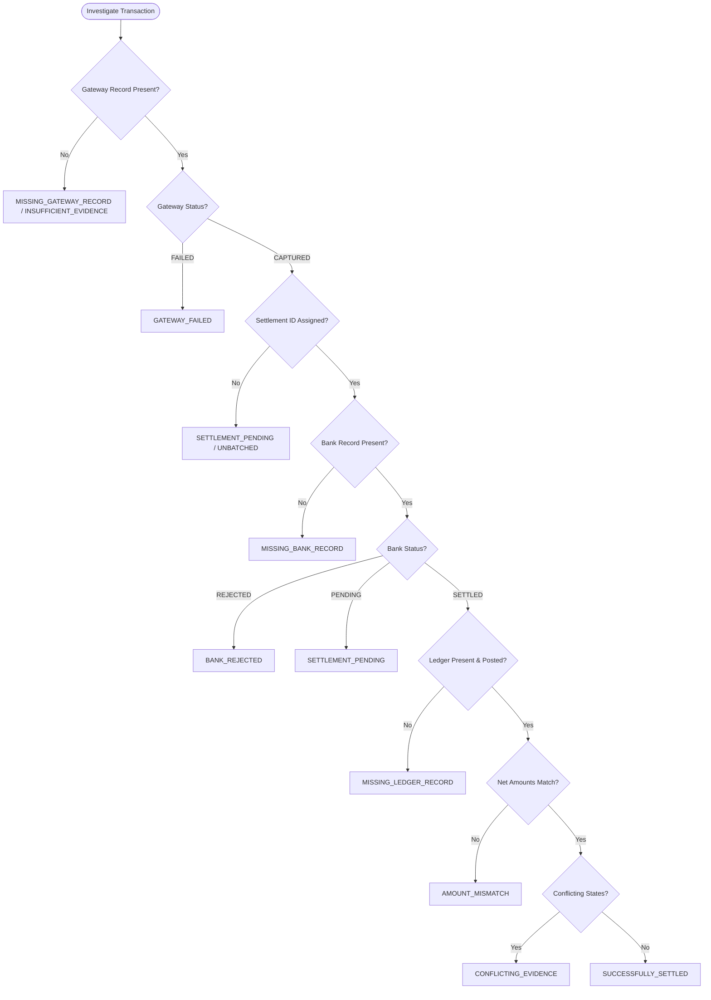

# Product Requirements Document (PRD)

## Project: PS-8 — Settlement Q&A Agent for Fintech Support
**Document Version:** 1.0.0  
**Target Milestone:** Hackathon MVP  
**Category:** AI + Development / Fintech Systems  
**Status:** Approved for Implementation  
**Primary Principle:** *Deterministic systems establish financial truth; AI explains that truth.*

---

## 1. Executive Summary & Problem Definition

### 1.1 Context & Problem Statement
In digital payment platforms, merchants and businesses frequently contact customer support with critical operational queries, most commonly:
> *"Why wasn't my settlement processed?"*
> *"My transaction TXN_10482 succeeded, but where is my money?"*

Today, answering this single question requires support and payment operations staff to manually pivot across three or more disconnected internal systems:
1. **Payment Gateway Logs:** To verify if payment was authorized, captured, and assigned a settlement batch ID.
2. **Bank Settlement Records:** To inspect nodal/escrow bank clearing files, Unique Transaction References (UTRs), bank status codes, and network rejection reasons.
3. **Internal Accounting Ledgers:** To check double-entry journal entries, balance postings, fee deductions, and hold/reserve flags.

This manual workflow causes severe operational friction:
* High Average Handle Time (AHT) of 15–30 minutes per settlement ticket.
* High error rate due to human misinterpretation of cross-system identifiers (e.g., confusing an Order ID with a Gateway Reference or Bank UTR).
* Inconsistent merchant communications, ranging from overly technical internal jargon to misleading guarantees ("the bank rejected your payment" when the record was simply pending or unposted).

### 1.2 Proposed Solution
The **Settlement Q&A Agent** is an AI-assisted investigation and support assistant designed specifically for payment-platform support agents. The system ingests and traces mock multi-system financial data, runs a deterministic reconciliation engine to establish undeniable ground facts, and leverages a controlled Large Language Model (LLM) explanation layer to generate plain-English diagnostic summaries and safe, merchant-facing responses.

### 1.3 Core Architectural Invariant
The system strictly rejects the unreliable pattern of `Data → LLM → Decision`. Instead, it enforces:

```
[Gateway CSV] ─┐
[Bank CSV]    ──┼─► [Cross-System Tracing & Chaining Engine]
[Ledger CSV]  ─┘                    │
                                    ▼
                     [Deterministic Reconciliation Engine]
                                    │
                                    ▼
                        [Verified Evidence Object]
                                    │
                         ┌──────────┴──────────┐
                         ▼                     ▼
             [Deterministic UI View]   [Constrained LLM Agent]
             (Status, Tables, Timeline) (Explanations & Safe Responses)
```

The LLM is treated exclusively as a natural language synthesizer and contextual communicator. **The LLM is strictly prohibited from inferring financial balances, determining failure causes, or declaring settlement success without explicit verification from the reconciliation engine.**

---

## 2. Product Principles

1. **Evidence Over Assumptions:** Never state a financial fact that cannot be directly traced to a verified database or log record.
2. **Deterministic Truth, AI Explanation:** Calculations, cross-system joins, status determinations, and discrepancy categorizations must be executed 100% in code. AI articulates and translates verified findings into human language.
3. **Epistemic Honesty (Honest Uncertainty):** Missing data must always be reported as missing data—never as an inferred failure, assumption, or hallucinated banking reason.
4. **Explainability & Traceability:** Every diagnostic conclusion presented to the user must be backed by transparent, clickable, inspectable source evidence from each underlying system.
5. **Support-First UX:** Optimize for the frontline support agent. Minimize mental fatigue by presenting the bottom line first, followed by clear next actions, an exact timeline, and copy-paste-ready merchant responses.
6. **Lean & Resilient Hackathon Architecture:** Eliminate unnecessary infrastructure (e.g., heavyweight vector databases, distributed worker queues, recursive multi-agent loops) in favor of fast, reliable, reproducible local execution.

---

## 3. User Personas & User Requirements

### 3.1 Primary Persona: Frontline Support Agent
* **Role:** Level-1 & Level-2 Customer Support Representative for Payment Gateways.
* **Goal:** Quickly diagnose why a merchant's payout/settlement is delayed or missing, understand the root cause without SQL knowledge, and provide an accurate, reassuring, policy-compliant response to the merchant.
* **Pain Points:** 
  * Has to correlate data across multiple dashboards or raw CSVs.
  * Afraid of giving incorrect financial advice or making false promises to angry merchants.
  * Stressed by ticket turnaround time metrics.
* **Key Needs:**
  * Single search box accepting any identifier (`transaction_id`, `order_id`, `settlement_id`, `UTR`, or natural query).
  * Clear traffic-light status (`SUCCESSFULLY_SETTLED`, `SETTLEMENT_PENDING`, `BANK_REJECTED`, etc.).
  * Pre-drafted "Merchant-Facing Response" that is safe to send immediately.

### 3.2 Secondary Persona: Payment Operations Analyst
* **Role:** Level-3 Payment Operations & Settlement Reconciliation Specialist.
* **Goal:** Investigate settlement breaks, identify batch-level systemic anomalies (e.g., 50 transactions failing at a partner bank on a specific date), and reconcile ledger discrepancies.
* **Pain Points:** 
  * Difficulty quickly isolating whether a break is caused by gateway fee miscalculations, bank file drops, or ledger unposted events.
* **Key Needs:**
  * Multi-system cross-reference view with detailed discrepancy breakdowns (e.g., fee mismatches, timing gaps).
  * Date-level batch investigation and exception classification counts.

### 3.3 Secondary Persona: Support / Ops Manager
* **Role:** Customer Operations Lead.
* **Goal:** Monitor recurring settlement complaint drivers and track exception volumes across categories.
* **Key Needs:**
  * Lightweight operational dashboard summarizing daily/weekly settlement states across investigated volumes.

---

## 4. Systems & Data Specification

The system operates across three distinct synthetic datasets, representing real-world payment infrastructure silos.

### 4.1 Payment Gateway System (`gateway.csv`)
Represents the merchant-facing checkout and processing engine. Captures customer payment authorizations, merchant fees, and settlement batch assignments.

| Field Name | Type | Nullable | Description & Constraints | Example |
| :--- | :--- | :--- | :--- | :--- |
| `transaction_id` | String | No | Primary key. Unique gateway transaction identifier. Pattern: `TXN_[0-9]{5}` | `TXN_10482` |
| `order_id` | String | No | Merchant's internal e-commerce order reference. Pattern: `ORD_[0-9]{5}` | `ORD_90210` |
| `gateway_reference`| String | No | Payment processor reference code. Pattern: `GW_REF_[A-Z0-9]{8}` | `GW_REF_A8F932BC` |
| `amount` | Decimal | No | Total authorized transaction amount charged to customer. Positive number. | `5000.00` |
| `fee` | Decimal | No | Processing fee deducted by the gateway. Non-negative. | `150.00` |
| `status` | Enum | No | `AUTHORIZED`, `CAPTURED`, `FAILED`, `REFUNDED` | `CAPTURED` |
| `created_at` | ISO-8601 | No | Timestamp of transaction initiation. | `2026-09-03T10:32:14Z` |
| `captured_at` | ISO-8601 | Yes | Timestamp of payment capture. Null if `status == FAILED`. | `2026-09-03T10:32:17Z` |
| `settlement_id` | String | Yes | Batch settlement ID assigned when batched for bank payout. Null if not batched. | `SET_55012` |

### 4.2 Bank Settlement System (`bank.csv`)
Represents the banking partner / clearing house file (e.g., NEFT/RTGS/ACH/IMPS nodal clearing). Contains actual payout credit instructions and banking status codes.

| Field Name | Type | Nullable | Description & Constraints | Example |
| :--- | :--- | :--- | :--- | :--- |
| `settlement_id` | String | No | Foreign key linking to Gateway settlement batch ID. | `SET_55012` |
| `utr` | String | Yes | Unique Transaction Reference issued by the banking rail upon dispatch. | `UTR99283471029` |
| `amount` | Decimal | No | Net amount disbursed to merchant bank account. | `4850.00` |
| `settlement_date` | Date/ISO | Yes | Date on which the bank cleared or attempted the transfer. | `2026-09-03` |
| `bank_status` | Enum | No | `SETTLED`, `PENDING`, `REJECTED` | `PENDING` |
| `failure_reason` | Enum/Str | Yes | Standardized bank failure code. Null if `bank_status != REJECTED`. Options: `INVALID_ACCOUNT`, `BENEFICIARY_BANK_OFFLINE`, `ACCOUNT_BLOCKED`, `LIMIT_EXCEEDED`, `NAME_MISMATCH`, `NONE` | `INVALID_ACCOUNT` |

### 4.3 Internal Ledger System (`ledger.csv`)
Represents the double-entry financial bookkeeping system verifying that money was recorded in internal accounts before or after payout.

| Field Name | Type | Nullable | Description & Constraints | Example |
| :--- | :--- | :--- | :--- | :--- |
| `ledger_entry_id` | String | No | Primary key for accounting journal entry. Pattern: `LED_[0-9]{6}` | `LED_701928` |
| `transaction_id` | String | No | Foreign key linking to Gateway transaction ID. | `TXN_10482` |
| `entry_type` | Enum | No | `CREDIT` (Merchant balance increase) or `DEBIT` (Settlement disbursement) | `CREDIT` |
| `debit` | Decimal | No | Debit monetary amount. `0.00` if credit entry. | `0.00` |
| `credit` | Decimal | No | Credit monetary amount. `0.00` if debit entry. | `4850.00` |
| `entry_date` | ISO-8601 | No | Timestamp the entry was committed to the ledger. | `2026-09-03T10:32:18Z` |
| `ledger_status` | Enum | No | `POSTED`, `PENDING`, `REVERSED`, `HOLD` | `POSTED` |
| `reference` | String | Yes | Cross-system reference tag (often holds `settlement_id` or `order_id`). | `SET_55012` |

---

## 5. Multi-System Tracing & Reference Chaining

Real financial platforms do not share a single universal transaction ID across external clearing rails. The agent must implement deterministic **Reference Chaining** to reconstruct the end-to-end transaction journey.

### 5.1 Resolution Hop Rules
The tracing engine must resolve entities across systems via the following graph hops:

```
[Search Input: Transaction ID / Order ID / Settlement ID / UTR]
                               │
            ┌──────────────────┼──────────────────┐
            ▼                  ▼                  ▼
     [Gateway Record]  [Ledger Record]    [Bank Record]
     (via transaction_id (via transaction_id (via settlement_id
      or order_id)        or reference)       or utr)
            │                  ▲                  ▲
            │                  │                  │
            └──► settlement_id ┴──────────────────┘
```

1. **Hop 1 (Direct Match):**
   * Search input matched against `gateway.transaction_id`, `gateway.order_id`, `gateway.settlement_id`, `bank.settlement_id`, `bank.utr`, `ledger.transaction_id`, and `ledger.ledger_entry_id`.
2. **Hop 2 (Forward & Backward Chaining):**
   * If matched on `transaction_id` in Gateway:
     * Extract `settlement_id`.
     * Query Bank using `settlement_id`.
     * Query Ledger using `transaction_id` (and fallback to `reference == settlement_id`).
   * If matched on `utr` or `settlement_id` in Bank:
     * Query Gateway using `settlement_id`.
     * Once Gateway record(s) resolved, query Ledger using `gateway.transaction_id`.
   * If matched on `order_id` in Gateway:
     * Resolve `gateway.transaction_id` and proceed with forward chaining.
3. **Orphan & Incomplete Chain Detection:**
   * If a record exists in one system but the link breaks (e.g., Gateway has `settlement_id = SET_99999`, but no such record exists in `bank.csv`), the tracing engine must not fail or drop the trace. It must preserve the partial graph and emit a `BROKEN_CHAIN` exception flag.

---

## 6. Deterministic Reconciliation Engine

The reconciliation engine is a pure algorithmic component. It accepts the linked records across Gateway, Bank, and Ledger, applies financial logic rules, detects discrepancies, and outputs a canonical classification and evidence structure.

### 6.1 Discrepancy Detection Matrix
The engine must evaluate the following discrepancy checks:

| Discrepancy Type | Internal Flag | Trigger Condition | Severity |
| :--- | :--- | :--- | :--- |
| **Status Mismatch** | `ERR_STATUS_MISMATCH` | Contradictory states across systems (e.g., Gateway is `CAPTURED`, Bank is `SETTLED`, but Ledger is `REVERSED` or `HOLD`). | High |
| **Amount Mismatch** | `ERR_AMOUNT_MISMATCH` | `gateway.amount - gateway.fee != bank.amount` OR `bank.amount != ledger.credit` (within a tolerance of ±0.01). | Critical |
| **Missing Bank Record** | `ERR_MISSING_BANK` | Gateway is `CAPTURED` and has `settlement_id`, but no record exists in `bank.csv`. | High |
| **Missing Ledger Record** | `ERR_MISSING_LEDGER` | Gateway is `CAPTURED`, but no corresponding entry exists in `ledger.csv`. | High |
| **Missing Gateway Record** | `ERR_MISSING_GATEWAY` | Bank or Ledger record exists referencing a transaction/settlement not present in `gateway.csv`. | Critical |
| **Reference Mismatch** | `ERR_REFERENCE_MISMATCH` | Gateway references `settlement_id_A`, but Ledger `reference` points to `settlement_id_B`. | Medium |
| **Duplicate Records** | `ERR_DUPLICATE_RECORD` | More than 1 Gateway record with same `transaction_id`, or multiple Bank settlements with same `utr`. | Critical |
| **Conflicting Evidence**| `ERR_CONFLICTING_EVIDENCE`| Bank reports `SETTLED` with a valid UTR, but Gateway reports `FAILED` or `REFUNDED`. | Critical |
| **Unbatched Settlement** | `INFO_UNBATCHED` | Gateway is `CAPTURED`, but `gateway.settlement_id` is null (settlement cycle not yet started). | Low |

### 6.2 Settlement Classification Taxonomy
The system must assign exactly one primary settlement diagnosis from this controlled set of 11 system states:



1. **`SUCCESSFULLY_SETTLED`**: Payment captured, settlement batch created, bank status `SETTLED` with valid UTR, ledger `POSTED`, and net amounts agree (`gateway.amount - fee == bank.amount == ledger.credit`).
2. **`SETTLEMENT_PENDING`**: Payment captured and batched, but bank status is `PENDING`, or within legitimate processing SLA window.
3. **`GATEWAY_FAILED`**: Customer payment was declined/failed at the gateway. No settlement was ever due.
4. **`BANK_REJECTED`**: Bank attempted disbursement but returned `REJECTED` with an explicit failure reason (e.g., `INVALID_ACCOUNT`).
5. **`AMOUNT_MISMATCH`**: Gateway, Bank, and/or Ledger net disbursement amounts differ beyond expected processing fees.
6. **`MISSING_BANK_RECORD`**: Payment captured and settlement ID generated, but clearing bank has no record of the batch or instruction.
7. **`MISSING_LEDGER_RECORD`**: Payment captured, but accounting journal entry was never posted in the ledger.
8. **`REFERENCE_MISMATCH`**: Identifier mismatch across systems (e.g., Bank file references a UTR not mapped in the internal settlement journal).
9. **`DUPLICATE_RECORD`**: Anomalous duplicate transaction or settlement records detected across files.
10. **`CONFLICTING_EVIDENCE`**: Unreconcilable logical contradiction across records (e.g., Bank marks transaction settled with UTR, but Gateway marks transaction failed).
11. **`INSUFFICIENT_EVIDENCE`**: Essential systems have no records or cross-system chaining cannot be established. Cannot determine settlement state.

---

## 7. Epistemic Honesty & Honest Exception Handling

A paramount product requirement is **Epistemic Honesty**. The system must never hallucinate certainty where the underlying records are silent.

### 7.1 The Tri-State Epistemic Model
Every investigation result must decompose its findings into three distinct operational buckets:

```
┌────────────────────────────────────────────────────────────────────────┐
│                        EPISTEMIC EVIDENCE MODEL                        │
├───────────────────┬──────────────────────┬─────────────────────────────┤
│      KNOWN        │       INFERRED       │           UNKNOWN           │
│ (Directly Provable│ (Logically Derived   │ (Silent / Absent in Data,   │
│  from Record Row) │  from Multi-System)  │  Explicitly Stated as Void) │
├───────────────────┼──────────────────────┼─────────────────────────────┤
│ • Gateway: CAPTURED│ • Net expected payout│ • Bank completion timestamp │
│ • Net Amt: ₹4,850 │   = ₹5000 - ₹150     │ • Clearing bank delay cause │
│ • Bank: PENDING   │ • Processing SLA has │ • Beneficiary name match    │
│ • UTR: None       │   exceeded 24 hours  │ • Destination bank status   │
└───────────────────┴──────────────────────┴─────────────────────────────┘
```

1. **KNOWN Facts:**
   * Direct values parsed from records.
   * *Example:* "Gateway status is CAPTURED at 10:32:17 UTC. Fee is ₹150.00."
2. **INFERRED Deductions:**
   * Deterministic mathematical or rule-based deductions based on two or more KNOWN facts.
   * *Example:* "Expected net payout is ₹4,850.00 (calculated as Amount ₹5,000.00 minus Fee ₹150.00)."
3. **UNKNOWN Gaps (Mandatory Exception Reporting):**
   * Missing records, null fields, or external system silence that prevents a complete determination.
   * *Strict Prohibition:* The agent **MUST NOT** claim "the bank's server was down" or "the customer's account had insufficient funds" unless a concrete code in `bank.csv` explicitly states that reason. If `failure_reason` is blank or the bank row is absent, the system must say: *"Bank reason unavailable."*

### 7.2 Strict Guardrail Rule Set for AI Generation
The backend must validate the LLM prompt and output against these guardrails:
* **Rule 1 (No Unattributed Causes):** If `bank.failure_reason == null`, the response must never invent a reason for a pending or failed state.
* **Rule 2 (No False Assurances):** The agent must never say "your money will arrive in X hours" unless a verified SLA rule is deterministically supplied in the context.
* **Rule 3 (Preserve Exact Values):** Currency symbols, amounts, UTR strings, and timestamps in the AI text must match the verified evidence object to the letter.

---

## 8. Confidence Scoring Framework

Every investigation output must display a deterministic **Confidence Level** (`HIGH`, `MEDIUM`, `LOW`) accompanied by an explainable heuristic rationale.

### 8.1 Confidence Determination Rules
Confidence is calculated algorithmically based on evidence completeness and cross-system consistency:

| Confidence Level | Criteria & Heuristic Rules | Example Scenario |
| :--- | :--- | :--- |
| **HIGH** | * Complete chain: All 3 systems (Gateway, Bank, Ledger) are present and resolved.<br>* Consistency: Statuses and net amounts perfectly agree.<br>* Or: Gateway is conclusively `FAILED` with no subsequent settlement attempts. | Normal successful settlement with UTR; or legitimate bank rejection with explicit code. |
| **MEDIUM** | * Core records exist (Gateway captured + Ledger posted), but Bank record is `PENDING` without a UTR.<br>* Or: Single non-critical metadata gap (e.g., bank settlement timestamp missing, but UTR present and status is `SETTLED`). | Transaction captured today, settlement initiated, but bank clearing response pending within standard window. |
| **LOW** | * Missing primary system record (e.g., Bank record missing entirely, or Ledger entry unposted).<br>* Conflicting evidence between Gateway and Bank.<br>* Amount mismatch detected.<br>* Orphan record where reference chaining failed. | Gateway claims captured for ₹5,000, but Bank has no record of `settlement_id`, or Bank shows ₹4,200 without explanation. |

*Note on Numeric Scores:* While a normalized numeric heuristic score (0–100%) may optionally be computed for UI progress bars (e.g., High = 95%, Medium = 70%, Low = 30%), the PRD defines this purely as an operational heuristic, not a calibrated statistical probability.

---

## 9. Verified Evidence Object & AI Explanation Layer

### 9.1 The Verified Evidence Object (VEO)
Prior to invoking the LLM, the reconciliation engine serializes all linked data, detected errors, and classifications into an immutable JSON payload.

```json
{
  "investigation_id": "INV_20260904_10482",
  "query_input": "TXN_10482",
  "resolved_identifiers": {
    "transaction_id": "TXN_10482",
    "order_id": "ORD_90210",
    "gateway_reference": "GW_REF_A8F932BC",
    "settlement_id": "SET_55012",
    "bank_utr": null,
    "ledger_entry_id": "LED_701928"
  },
  "deterministic_diagnosis": "SETTLEMENT_PENDING",
  "confidence": "MEDIUM",
  "confidence_reason": "Gateway capture and ledger posting verified; bank status is PENDING with no UTR issued.",
  "system_states": {
    "gateway": {
      "found": true,
      "status": "CAPTURED",
      "amount": 5000.00,
      "fee": 150.00,
      "net_expected": 4850.00,
      "captured_at": "2026-09-03T10:32:17Z"
    },
    "bank": {
      "found": true,
      "status": "PENDING",
      "amount": null,
      "utr": null,
      "settlement_date": null,
      "failure_reason": null
    },
    "ledger": {
      "found": true,
      "status": "POSTED",
      "credit": 4850.00,
      "debit": 0.00,
      "entry_date": "2026-09-03T10:32:18Z"
    }
  },
  "discrepancies": [],
  "epistemic_breakdown": {
    "known_facts": [
      "Customer payment of ₹5,000.00 captured on 2026-09-03 10:32:17 UTC",
      "Gateway processing fee of ₹150.00 deducted",
      "Ledger posted credit entry of ₹4,850.00 under settlement batch SET_55012",
      "Bank settlement record is marked PENDING"
    ],
    "inferred_facts": [
      "Net expected settlement amount is ₹4,850.00"
    ],
    "unknown_information": [
      "Bank clearing timestamp unavailable",
      "Bank Unique Transaction Reference (UTR) not yet issued",
      "Exact payout delivery time to merchant account unavailable"
    ]
  },
  "recommended_actions": [
    "Advise merchant that payment is captured and undergoing standard bank clearing",
    "Instruct merchant to wait until next settlement window before escalating"
  ]
}
```

### 9.2 LLM Explanation & Response Synthesizer
The AI explanation layer passes the Verified Evidence Object to a lightweight LLM (e.g., Google Gemini 1.5 Flash or Groq Llama 3) using a strict system prompt.

The LLM is tasked with generating two separate, purpose-built explanations:
1. **Internal Support Explanation:** Highly technical, precise, detailing cross-system statuses, math, and specific system breaks for the agent's understanding.
2. **Merchant-Friendly Response:** Professional, clear, empathetic, non-jargon, and completely safe to copy-paste directly into an email or chat ticket with the merchant.

#### Contrast Example:
* **Internal Explanation:**
  > *"Transaction TXN_10482 captured successfully for ₹5,000.00 with ₹150.00 fee. Internal ledger posted ₹4,850.00 to SET_55012. However, Bank file reports settlement status as PENDING and has not issued a UTR. No failure code was returned. System diagnosis is SETTLEMENT_PENDING with MEDIUM confidence due to absent bank clearing confirmation."*
* **Merchant-Friendly Response:**
  > *"Hello! Your payment for Order ORD_90210 (₹5,000.00) was successfully processed. The net settlement of ₹4,850.00 (after standard fees) has been batched and is currently being processed by our banking partner. The bank has not yet completed the transfer or generated a final reference number (UTR). Please allow until the next standard clearing cycle for the funds to reflect in your account."*

---

## 10. Detailed Feature Specifications

### Feature 1: Transaction Investigation & Search Handler
* **Description:** Unified investigation input bar capable of resolving diverse input formats.
* **Input Types Supported:**
  * Direct IDs: `TXN_10482` (Transaction ID), `ORD_90210` (Order ID), `SET_55012` (Settlement ID), `UTR99283471029` (Bank UTR), `LED_701928` (Ledger Entry ID).
  * Natural Language Queries: *"Why wasn't TXN_10482 settled?"*, *"Check status of ORD_90210"*, *"Where is the money for UTR99283471029?"*.
  * Date / Temporal Queries: *"Show delayed settlements from September 3"*, *"List failures on 2026-09-03"*.
* **Processing Workflow:**
  1. Regex entity extractor parses known ID patterns.
  2. If ID found, invoke Tracing Engine directly.
  3. If date query found, route to Date-Based Investigation Engine.
  4. If query is a general natural language question mentioning an ID, extract the target ID and treat question as a contextual prompt for the LLM response phase.

### Feature 2: Multi-System Transaction Trace & Reference Chaining
* **Description:** Cross-file correlation service linking Gateway, Bank, and Ledger entities.
* **Functional Behavior:**
  * Ingests and indexes `gateway.csv`, `bank.csv`, and `ledger.csv` in-memory.
  * Resolves multi-hop joins per Section 5.
  * Flags missing relationships as discrete errors (`ERR_MISSING_BANK`, `ERR_MISSING_LEDGER`).
  * Assembles unified timeline events with timestamps normalized to UTC.

### Feature 3: Deterministic Reconciliation & Classification
* **Description:** Algorithmic verification of amounts, statuses, and ledger postings.
* **Functional Behavior:**
  * Runs all 9 discrepancy rules (Section 6.1).
  * Classifies the transaction into one of the 11 canonical settlement states (Section 6.2).
  * Generates the immutable Verified Evidence Object (VEO).

### Feature 4: AI Explanation Layer & Epistemic Guardrails
* **Description:** Generates dual-channel explanations (Internal vs Merchant-Facing) via LLM.
* **Functional Behavior:**
  * Formats prompt with strict system instructions prohibiting unverified statements.
  * Injects VEO JSON into user message.
  * Parses LLM response into structured sections: Summary, Root Cause, Known Facts, Unknown Facts, and Merchant-Ready Script.

### Feature 5: Multi-System Evidence View & Lifecycle Timeline
* **Description:** Visual inspection panel comparing the three system records side-by-side.
* **Visual Components:**
  1. **Three-Card System Inspector:**
     * Gateway Card: Status badge, Gross Amount, Fee, Net, Order ID, Capture Time.
     * Bank Card: Status badge, Disbursed Amount, Settlement Date, UTR, Bank Failure Reason.
     * Ledger Card: Status badge, Entry Type, Credit/Debit, Ledger Entry ID, Posting Time.
  2. **Chronological Lifecycle Timeline:**
     * Renders sequential events:
       * `10:32:14 UTC` — Payment Initiated (Gateway)
       * `10:32:17 UTC` — Payment Captured (Gateway)
       * `10:32:18 UTC` — Credit Entry Posted (Ledger)
       * `11:00:00 UTC` — Batched under SET_55012 (Gateway)
       * `11:30:00 UTC` — Bank Transfer Pending (Bank)
       * `CURRENT` — Awaiting Bank Settlement Confirmation

### Feature 6: Natural Language Follow-Up Q&A
* **Description:** Interactive conversational box allowing the agent to ask follow-up questions about the active transaction.
* **Functional Behavior:**
  * Retains active transaction's VEO as context memory.
  * Permitted Questions:
    * *"Was the customer charged?"*
    * *"What exact fee was deducted?"*
    * *"Did the bank reject this due to an invalid account?"*
    * *"Can I safely tell the merchant that the payment succeeded?"*
  * The agent responds strictly using the cached VEO. If a user asks something out-of-scope or unrecorded (*"What is the customer's phone number?"*), the agent responds: *"That information is not available in the transaction evidence."*

### Feature 7: Date-Based Investigation & Exception Dashboard
* **Description:** Macro-level settlement batch investigation view.
* **Functional Behavior:**
  * Filters transactions by creation date or settlement date range.
  * Runs reconciliation engine across all filtered transactions.
  * Renders summary metrics:
    * Total Transactions Investigated
    * Successfully Settled Count & Rate (%)
    * Settlement Pending Count
    * Bank Rejected Count
    * Amount Mismatches Count
    * Missing System Records Count
    * Conflicting / Insufficient Evidence Count
  * Provides an interactive table listing transactions tagged with exception badges. Clicking any row immediately opens the deep-dive Investigation View for that transaction.

---

## 11. Synthetic Data Generation & Benchmark Scenarios

Because real banking data cannot be used, the project requires a synthetic data generator producing realistic, fully consistent, edge-case-rich CSV datasets along with a ground-truth evaluation file.

### 11.1 Controlled Test Scenarios (Ground Truth Benchmark)
The synthetic generator must produce at least 100 transactions covering the following 11 canonical test scenarios:

| Scenario ID | Test Scenario Name | Gateway Status | Bank Status | Ledger Status | Amount Logic | Expected Diagnosis | Key Verification Point |
| :--- | :--- | :--- | :--- | :--- | :--- | :--- | :--- |
| **SC-01** | Happy Path Settled | `CAPTURED` | `SETTLED` | `POSTED` | ₹5000 - ₹150 = ₹4850 = ₹4850 | `SUCCESSFULLY_SETTLED` | All systems agree; UTR valid. Confidence: HIGH. |
| **SC-02** | Settlement In Progress | `CAPTURED` | `PENDING` | `POSTED` | ₹2500 - ₹75 = ₹2425 | `SETTLEMENT_PENDING` | Bank row exists, status PENDING. No UTR. |
| **SC-03** | Bank Account Rejection | `CAPTURED` | `REJECTED` | `POSTED` | ₹10000 | `BANK_REJECTED` | Bank `failure_reason = INVALID_ACCOUNT`. |
| **SC-04** | Payment Dropped at Gate | `FAILED` | Absent | Absent | ₹3000 | `GATEWAY_FAILED` | Gateway failed; no settlement ever created. |
| **SC-05** | Fee/Amount Mismatch | `CAPTURED` | `SETTLED` | `POSTED` | GW Net ₹4850 vs Bank ₹4500 | `AMOUNT_MISMATCH` | Bank disbursed ₹350 less than expected net. |
| **SC-06** | Bank File Missing Batch | `CAPTURED` | Absent | `POSTED` | ₹1200 | `MISSING_BANK_RECORD` | `settlement_id` in GW not found in Bank CSV. |
| **SC-07** | Ledger Unposted Break | `CAPTURED` | `SETTLED` | Absent | ₹8000 | `MISSING_LEDGER_RECORD` | Money cleared bank, but missing in ledger. |
| **SC-08** | Reference ID Mismatch | `CAPTURED` | `SETTLED` | `POSTED` | Match | `REFERENCE_MISMATCH` | Ledger references wrong settlement batch ID. |
| **SC-09** | Duplicate Bank UTR | `CAPTURED` | `SETTLED` | `POSTED` | Match | `DUPLICATE_RECORD` | Two distinct transactions share identical UTR. |
| **SC-10** | Contradictory Records | `FAILED` | `SETTLED` | `POSTED` | Match | `CONFLICTING_EVIDENCE` | Bank cleared funds for a failed gateway payment. |
| **SC-11** | Unbatched Capture | `CAPTURED` | Absent | `POSTED` | Match | `SETTLEMENT_PENDING` | `settlement_id` is null; captured within last 2 hrs. |

### 11.2 Ground Truth Specification (`ground_truth.json`)
The generator must automatically export a validation file mapping each `transaction_id` to expected diagnostic outputs:

```json
{
  "TXN_10482": {
    "scenario_id": "SC-02",
    "expected_diagnosis": "SETTLEMENT_PENDING",
    "expected_confidence": "MEDIUM",
    "expected_discrepancies": [],
    "expected_bank_reason": null,
    "known_facts_must_include": ["CAPTURED", "4850", "PENDING"],
    "unknown_facts_must_include": ["Bank clearing timestamp", "UTR"]
  }
}
```

---

## 12. Automated Evaluation System

To prevent unverified marketing claims, the solution must include an executable evaluation harness (`evaluate.py`) that tests the entire pipeline against `ground_truth.json`.

### 12.1 Evaluation Metrics
The evaluation suite must compute and display:
1. **Diagnosis Accuracy (%):** Percentage of transactions where `deterministic_diagnosis == expected_diagnosis`. Target: **100%** (deterministic code).
2. **Discrepancy Detection Precision & Recall (%):** Accuracy in flagging exact discrepancy flags (`ERR_AMOUNT_MISMATCH`, etc.). Target: **100%**.
3. **Reference Chaining Success Rate (%):** Correct resolution of multi-hop identifiers. Target: **100%**.
4. **Epistemic Honesty Score (%):** Verification that when a record field is null or missing, the explanation lists it under `unknown_information` and does NOT assert it as known. Target: **> 98%**.
5. **Anti-Hallucination Rate (%):** Zero occurrence of invented bank failure reasons or fictitious UTRs in the LLM response text when absent from the VEO. Target: **0% Hallucinations**.

---

## 13. User Experience & Interface Specifications

### 13.1 Conceptual Screen Layout
The user interface is designed for rapid information retrieval by a support agent handling active merchant chats or calls.

```
┌────────────────────────────────────────────────────────────────────────────────────────┐
│  SETTLEMENT Q&A AGENT  |  Fintech Operations Support                     [Ops Overview]│
├────────────────────────────────────────────────────────────────────────────────────────┤
│  🔍 Search Transaction ID, Order ID, Settlement ID, UTR, or ask a question...          │
│  [ e.g., "TXN_10482" or "Why wasn't ORD_90210 settled?" ]                  [ Investigate ]│
├────────────────────────────────────────────────────────────────────────────────────────┤
│  TRANSACTION: TXN_10482                                                                 │
│  Status: [ ⏳ SETTLEMENT PENDING ]            Confidence: [ 🟡 MEDIUM ] (Evidence Incomplete)│
├────────────────────────────────────────────────────────────────────────────────────────┤
│  CROSS-SYSTEM EVIDENCE TRACE                                                           │
│  ┌──────────────────────┐   ┌──────────────────────┐   ┌──────────────────────┐        │
│  │ 💳 PAYMENT GATEWAY   │   │ 🏦 BANK CLEARING     │   │ 📒 INTERNAL LEDGER   │        │
│  │ Status: CAPTURED     │   │ Status: PENDING      │   │ Status: POSTED       │        │
│  │ Gross:  ₹5,000.00    │   │ Amount: —            │   │ Credit:  ₹4,850.00   │        │
│  │ Fee:    ₹150.00      │   │ UTR:    Not Issued   │   │ Debit:   ₹0.00       │        │
│  │ Net:    ₹4,850.00    │   │ Date:   —            │   │ Batch:   SET_55012   │        │
│  │ Batch:  SET_55012    │   │ Reason: None Reported│   │ Entry:   LED_701928  │        │
│  └──────────────────────┘   └──────────────────────┘   └──────────────────────┘        │
├────────────────────────────────────────────────────────────────────────────────────────┤
│  LIFECYCLE TIMELINE                                                                    │
│  ● 10:32:14 - Payment Initiated (Gateway)                                              │
│  ● 10:32:17 - Captured ₹5,000.00 (Gateway)                                             │
│  ● 10:32:18 - Credit ₹4,850.00 Posted (Ledger)                                         │
│  ● 11:00:00 - Included in Batch SET_55012 (Gateway)                                    │
│  ○ 11:30:00 - Bank Transfer Status: PENDING (Bank)                                     │
│  ⏹ CURRENT   - Awaiting Bank Clearing & UTR Generation                                 │
├────────────────────────────────────────────────────────────────────────────────────────┤
│  AI DIAGNOSTIC EXPLANATION                                                             │
│  Internal Summary:                                                                     │
│  Payment was captured and credited internally. Dispatched to bank in batch SET_55012,  │
│  but bank file reports status as PENDING. No bank failure reason was recorded.        │
│                                                                                        │
│  📋 Safe Merchant-Facing Response:                                        [ Copy Text ]│
│  "Your payment of ₹5,000.00 was successfully processed. The net settlement of         │
│   ₹4,850.00 has been batched and is currently clearing through the banking network.    │
│   Bank reference numbers (UTRs) are generated upon completion. Please check back after │
│   the next settlement cycle."                                                          │
├────────────────────────────────────────────────────────────────────────────────────────┤
│  EPISTEMIC BREAKDOWN & EXCEPTIONS                                                      │
│  ✓ Known: Payment captured; ₹150 fee deducted; Ledger posted; Bank status pending.    │
│  ⚠ Missing/Unknown: Bank completion timestamp; Bank UTR; Bank delay reason.             │
├────────────────────────────────────────────────────────────────────────────────────────┤
│  💬 Ask a Follow-Up Question: [ Was the customer charged twice?               ] [ Send ]│
└────────────────────────────────────────────────────────────────────────────────────────┘
```

---

## 14. Non-Functional Requirements (NFRs)

### 14.1 Performance & Latency
* **Deterministic Trace & Reconciliation Latency:** $\le 150 \text{ ms}$ for single transaction investigation across datasets of up to 10,000 rows.
* **LLM Explanation Streaming / Generation:** $\le 3.0 \text{ seconds}$ time-to-first-token using high-speed free-tier models (Gemini Flash or Groq Llama 3).
* **Date-Range Batch Query Latency:** $\le 1.0 \text{ second}$ for scanning and summarizing 1,000 transactions.

### 14.2 Reliability & Determinism
* The reconciliation engine must be a deterministic state machine: Given identical CSV inputs and query ID, the output diagnosis, confidence tier, and discrepancy list must be 100% identical on every execution.
* The system must handle corrupted, missing, or malformed CSV rows gracefully without crashing, surfacing error badges in the UI.

### 14.3 Security & Privacy (Fintech Best Practices)
* Synthetic Data Only: No live credentials, production PII, card numbers, or live banking connections.
* Read-Only Operations: The system is strictly an investigation and Q&A tool. It has no write permissions, no ability to initiate refunds, and no ability to trigger bank transfers.

### 14.4 Explainability & Verifiability
* Every claim in the UI must link back to an explicit source record. Hovering over or clicking a fact in the explanation highlights the source row in the Multi-System Evidence view.

---

## 15. Scope Management & Prioritization

To ensure an impactful, high-quality delivery within hackathon constraints, features are strictly prioritized:

```
┌─────────────────────────────────────────────────────────────────────────┐
│                      HACKATHON SCOPE MATRIX                             │
├──────────────────────┬──────────────────────┬───────────────────────────┤
│   P0 (Must Have)     │   P1 (Should Have)   │   P2 (Nice to Have)       │
│   Core MVP Delivery  │   Enhanced Support   │   Post-Hackathon Roadmap  │
├──────────────────────┼──────────────────────┼───────────────────────────┤
│ • Ingestion of 3 CSVs│ • Natural-language   │ • Advanced visual trend   │
│ • Reference chaining │   search input       │   charts / analytics      │
│ • Deterministic      │ • Lifecycle timeline │ • Exportable PDF report   │
│   reconciliation     │   visualization      │ • Automated ticket        │
│ • 11 state taxonomy  │ • Contextual follow- │   webhook integration     │
│ • Tri-state honesty  │   up Q&A             │ • Multi-currency fx       │
│ • Confidence scoring │ • Date-range batch   │   conversion support      │
│ • Evidence card UI   │   investigation      │ • Automated synthetic     │
│ • Dual AI explanation│ • Exception overview │   data generation CLI     │
│ • Ground truth suite │   dashboard          │                           │
└──────────────────────┴──────────────────────┴───────────────────────────┘
```

### 15.1 P0 — Must Have (Core MVP)
* Ingestion and validation of `gateway.csv`, `bank.csv`, and `ledger.csv`.
* Multi-hop Reference Chaining (`transaction_id` $\leftrightarrow$ `settlement_id` $\leftrightarrow$ `utr`).
* Deterministic Reconciliation Engine implementing all 9 discrepancy checks.
* 11-State Settlement Classification Taxonomy.
* Epistemic Honesty Model separating Known, Inferred, and Unknown facts.
* Rule-based Confidence Scoring (`HIGH`, `MEDIUM`, `LOW`).
* Verified Evidence Object (VEO) generation.
* Dual AI Explanations: Internal Technical Summary + Safe Merchant Response.
* Synthetic Data Suite with ground truth test harness.

### 15.2 P1 — Should Have (High-Impact Additions)
* Free-form natural language query translation to transaction lookups.
* Interactive chronological investigation timeline.
* Context-bound follow-up Q&A chat.
* Date-based batch investigation and Exception Overview Dashboard.
* Automated accuracy & anti-hallucination benchmark evaluation runner.

### 15.3 P2 — Nice to Have (Future Enhancements)
* Time-series trend visualizations of settlement failure rates.
* One-click "Export Incident Report" (PDF/Markdown).
* Webhook simulator for incoming merchant support tickets.

---

## 16. Important Product Limitations & Non-Goals

### 16.1 Explicit Product Limitations
1. **Synthetic Data Sandbox:** The application runs solely against mock/synthetic CSV datasets. It does not connect to live banks, payment networks, or credit card rails.
2. **Read-Only Advisory Assistant:** The agent cannot execute settlements, reverse ledger entries, update bank accounts, or alter payment states.
3. **No Financial Guarantees:** Predictions or status assessments are diagnostic aids for human agents; the tool does not provide legal or financial accounting sign-offs.
4. **LLM Provider Constraints:** Relies on free-tier LLM endpoints; performance and token quotas are subject to third-party availability.
5. **Heuristic Confidence:** Confidence scores reflect data completeness and consistency heuristics, not Bayesian calibrated probabilities.

### 16.2 Explicit Non-Goals (Out of Scope)
* **No Real Payment Processing:** Will not integrate with live Stripe, Razorpay, Adyen, or PayPal APIs.
* **No Direct Banking Rails:** Will not communicate with Swift, ISO 20022, FedNow, or live UPI/IMPS banking switches.
* **No Full ERP/Accounting Suite:** Will not replace QuickBooks, NetSuite, or SAP.
* **No Complex Autonomous Multi-Agent Swarms:** Will not use sprawling multi-agent frameworks (e.g., CrewAI or AutoGen) where deterministic code is faster, cheaper, and 100% bug-free.
* **No Vector Databases / Heavy RAG:** Structured reconciliation on relational CSV keys does not require embeddings or semantic vector search.

---

## 17. Verification Plan & Acceptance Criteria

### 17.1 Feature-Level Acceptance Criteria

| Feature | Acceptance Criteria |
| :--- | :--- |
| **Transaction Search** | GIVEN a user enters `TXN_10482`, `ORD_90210`, or `SET_55012`, THEN the system resolves and loads the correct unified transaction record in $< 200\text{ ms}$. |
| **Reference Chaining** | GIVEN a query starting with a Bank UTR, THEN the system successfully traverses backward: `UTR` $\rightarrow$ `settlement_id` $\rightarrow$ `gateway.transaction_id` $\rightarrow$ `ledger_entry_id`. |
| **Amount Discrepancy** | GIVEN a transaction where Gateway Net is ₹4,850.00 and Bank Disbursed is ₹4,500.00, THEN the engine flags `ERR_AMOUNT_MISMATCH` and classifies the state as `AMOUNT_MISMATCH`. |
| **Missing Bank Record** | GIVEN a captured transaction whose `settlement_id` is missing from `bank.csv`, THEN the engine classifies as `MISSING_BANK_RECORD` with confidence `LOW`, and flags missing bank confirmation under Unknown Facts. |
| **Epistemic Honesty** | GIVEN a pending settlement with null bank failure reason, THEN the AI explanation MUST NOT claim the bank had a technical failure, server outage, or account issue. It must state: *"No bank failure reason was reported."* |
| **Dual Explanations** | GIVEN an investigated transaction, THEN the system presents both an internal technical breakdown and a merchant-safe response devoid of internal ledger IDs or unconfirmed speculation. |
| **Follow-Up Q&A** | GIVEN an investigated transaction, WHEN the agent asks *"Did our ledger record the payment?"*, THEN the system answers affirmatively with the exact credit amount and posting timestamp from the VEO. |
| **Automated Evaluation** | GIVEN the command `python evaluate.py`, THEN the test runner evaluates all 11 benchmark scenarios and reports $\ge 98\%$ diagnostic accuracy and $0\%$ hallucination rate. |

### 17.2 Canonical Demonstration Checklist (Hackathon Presentation)
The demo flow must walk through 5 live scenarios proving the system's superiority over a naive chatbot:
1. **Demo 1: The Clean Settlement (SC-01)**
   * Input: `TXN_10001`
   * Show: All cards green, UTR visible, High Confidence, Merchant response confirms delivery.
2. **Demo 2: The In-Flight Delay (SC-02)**
   * Input: `TXN_10482`
   * Show: Bank pending, no UTR, Medium Confidence. Notice how the agent refrains from assuming failure.
3. **Demo 3: The Amount Break (SC-05)**
   * Input: `TXN_10025`
   * Show: Red amount mismatch warning badge. Gateway expects ₹4,850, Bank settled ₹4,500. Clear internal alert to investigate ₹350 discrepancy.
4. **Demo 4: The Missing Bank Record (SC-06)**
   * Input: `TXN_10040`
   * Show: Bank card shows "Record Missing". Low Confidence. Epistemic breakdown lists bank clearing as unknown.
5. **Demo 5: Follow-Up Q&A Guardrail**
   * Question: *"Did the customer's bank reject this because of insufficient balance?"*
   * System Output: *"No. The available bank record shows no rejection reason or insufficient balance code. The status remains pending."*

---

## 18. Appendix & Domain Glossary

* **Capture:** The stage in credit card and payment processing where authorized funds are formally claimed by the merchant from the customer's issuing bank.
* **Disbursement / Payout:** The physical movement of funds from the payment gateway's nodal/escrow bank account to the merchant's business checking account.
* **Double-Entry Ledger:** An accounting system where every transaction requires both a debit and a credit entry to maintain balance ($Assets = Liabilities + Equity$).
* **Epistemic Honesty:** The discipline of distinguishing between what is known with empirical certainty, what is inferred, and what is unknown, avoiding false claims.
* **Gateway Reference:** A unique token generated by an online payment gateway (e.g., Stripe, Razorpay) to identify an authorization attempt.
* **Nodal / Escrow Account:** A specialized intermediary bank account mandated by financial regulators to hold customer funds safely before settlement disbursement to merchants.
* **Settlement Batch:** An aggregation of hundreds or thousands of captured transactions consolidated into a single net payout instruction sent to a partner bank.
* **UTR (Unique Transaction Reference):** A 16-to-22-character alphanumeric code generated by banking networks (e.g., NEFT, RTGS, IMPS, Fedwire) to uniquely identify an individual fund transfer.
